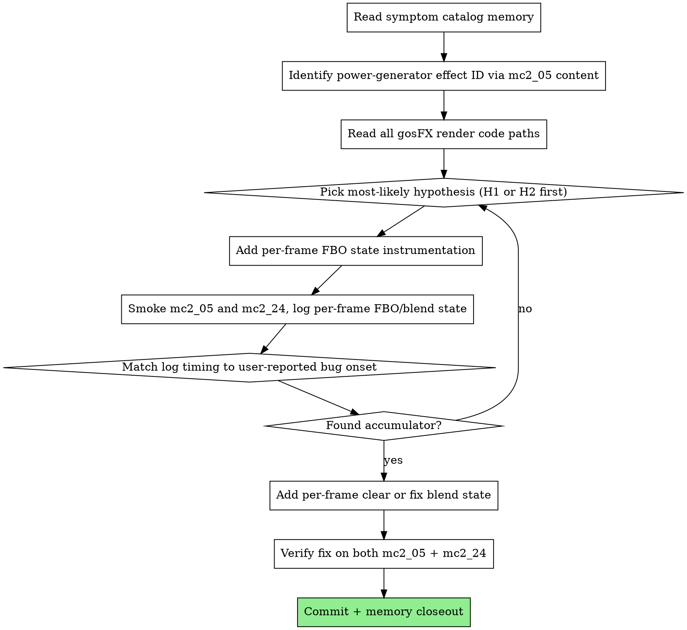

# Bloom / particle white-screen accumulation bug — fresh-session investigation handoff — 2026-05-01

> **Status:** intermittent recurring bug, root-cause unknown. User has observed it across many missions over a long time period (predates the indirect-terrain migration). Investigation in this session ruled out the cement multi-sampler slice's bridge state hygiene as the cause. Needs a dedicated instrumentation session with no feature-slice context.

This is a **self-contained handoff prompt for a fresh Claude Code session**. Paste the entire document into a new session.

---

## TL;DR

A recurring intermittent rendering bug causes the screen to ramp to max brightness over ~1 second, with cursor leaving permanent trails in the dark area while rendering normally over the white-saturated area. User-confirmed correlation: the bug fires **when a gosFX particle effect is visible on screen**, specifically observed on mc2_05 with the large-scale power-generator electricity effect (electricity rising from pylons). mc2_24 (final tier1 mission, heaviest base coverage = most active emitters) is most prone to it.

The bug **pre-dates the indirect-terrain migration** — was present when terrain was still CPU-drawn. A coincidental correlation with `MC2_TERRAIN_INDIRECT=1` during the cement multi-sampler slice was followed up with multiple defensive fixes in the indirect-terrain bridge (`gos_terrain_bridge_drawIndirect`) — none resolved the bug. Likely cause: **a particle/effect rendering pass with additive blend writes to an FBO that isn't cleared between frames**, causing geometric accumulation until saturation.

---

## Worktree

`A:/Games/mc2-opengl-src/.claude/worktrees/nifty-mendeleev/`. Branch `claude/nifty-mendeleev`.

Read `memory/bloom_bug_correlates_with_gosfx_effects.md` first for the symptom catalog and hypothesis pool.

Recent relevant commits:
- `e22fa3a` fix(terrain-indirect): slot-keyed cement layer lookup + pure-cement-only filter
- `1a130b0` docs(plan): v2.3 — engine cement-flag fix + 16-bit layer encoding
- `962b15e` feat(terrain-indirect): widen cement layer encoding from 8 to 16 bits
- `f60f5dd` fix(terrtxm): zero-init TerrainTXM::flags after bulk memset(-1)

---

## Symptom catalog (consolidated from session reports)

- Screen ramps to max brightness over ~1 second, then resets, then re-triggers in cycles
- Cursor "solitaire-ing": permanent trails of cursor positions accumulate in DARK regions; cursor renders normally in WHITE-saturated regions
- Triangle / wedge-shaped white area expanding across the screen
- HUD layer is unaffected (separate buffer / clear path)
- Region-dependent: white area receives fresh writes every frame; dark area is not cleared between frames
- "Things fade after 4-5 frames" of cumulative additive writes
- mc2_24 + mc2_05 most reproducible
- Visible only while certain particle effects are on screen (user-confirmed via mc2_05 power-generator pylon electricity sync)

---

## Eliminated (during cement slice 2026-05-01)

- Indirect-terrain bridge state save/restore is NOT the cause:
  - Tried defensive force-`glColorMask(TRUE,...)` on bridge exit — no fix
  - Tried defensive force-`useCementAtlas=0` (disable Stage B frag override entirely) — no fix
  - Tried defensive `glDisableVertexAttribArray(0)` on bridge exit — no fix
- Engine cement-flag bugfix at `terrtxm.cpp:162` is NOT the cause (reverting to garbage flags didn't change the symptom; bug exists with engine fix in place)
- `MC2_TERRAIN_INDIRECT=0` runs that LOOKED clean were due to camera path differences, not true negatives — running INDIRECT=0 with the same camera positions that triggered INDIRECT=1 may also reproduce, just less reliably (untested under controlled conditions)

---

## Hypothesis pool (in priority order)

### H1 — gosFX particle FBO never cleared between frames + additive blend
Most consistent with user observation that bug syncs with visible particle effect. If the particle pass writes to an intermediate FBO with `glBlendFunc(GL_ONE, GL_ONE)` (additive — typical for energy/electricity effects), and that FBO isn't `glClear`'d between frames, output accumulates. After 4-5 frames of full coverage in particle-affected regions → saturation.

### H2 — Bloom downsample ping-pong without inter-frame clear
At `gos_postprocess.cpp:529-581`, `runBloom()` clears `bloomFBO_[0]` only (line 545); `bloomFBO_[1]` is never cleared, only ping-pong-overwritten. If blend is enabled with additive function inherited from a prior pass, the ping-pong becomes additive — `bloomFBO_[1]` becomes a positive feedback accumulator across frames. Requires `bloomEnabled_` (default false) — verify whether user has bloom toggled on or whether smoke harness toggles it.

### H3 — God-rays composite is the additive vector
`gos_postprocess.cpp:838` does `glBlendFunc(GL_ONE, GL_ONE)` (additive) to composite god rays onto sceneFBO. Gated by `godrayEnabled_ && sceneHasTerrain_` (line 793). If god rays writes high values into sceneFBO without bound on the brightness, sceneFBO white-saturates over multiple frames where god rays are bright (sky direction).

### H4 — Particle FBO depth-test interaction
Particles draw with stale depth values, partial coverage, accumulate in covered regions while others stay clean. Could explain triangle-shaped white/dark boundary visible in the screenshots.

### H5 — HDR auto-exposure feedback loop
Particle brightness drives auto-exposure higher → more particles bright next frame → exposure compounds. Self-resets when feedback becomes unstable (consistent with cycling pattern user reported).

---

## Required reading (in order)

1. `memory/bloom_bug_correlates_with_gosfx_effects.md` — symptom + hypothesis catalog (this session's notes)
2. `GameOS/gameos/gos_postprocess.cpp` — full file. Look for missing per-frame `glClear` on FBOs that have additive blend writes.
   - Bloom path: lines 529-581
   - SSAO: 678-786 (clears its FBOs each pass — likely fine)
   - God rays: 788-870 (additive composite at 838)
   - Screen shadow: 598-700
3. Particle/effect rendering — find via `grep -rn "gosFX\|EffectLibrary\|CardCloud\|PertCloud\|DebrisCloud\|gos_tex_vertex" GameOS/gameos/ mclib/`. The effect for the power generator should be findable via mc2_05's effect CSVs and the WeaponBolt or object-effect-library lookup.
4. `GameOS/gameos/gameos_graphics.cpp:2217-2447` — indirect-terrain bridge. Already audited (no asymmetric save/restore found). Read for context only; do NOT pursue this as the root cause.
5. CLAUDE.md "gosFX particle system" section: data-driven via EffectLibrary, types CardCloud/Tube/PertCloud/DebrisCloud, renders through `gos_tex_vertex.frag`. Effect IDs: PPC=145, MECH_EXPLOSION=39, JET_CONTRAIL=58 (find power-generator ID by greping mc2_05's effect tables).

---

## Recommended workflow



## Suggested instrumentation (gated under env var)

```cpp
// In main render loop, between major passes:
static const bool s_bloomTrace = (getenv("MC2_BLOOM_TRACE") != nullptr);
#define BT_LOG(fmt, ...) \
    do { if (s_bloomTrace) { printf("[BLOOM_TRACE v1] " fmt "\n", ##__VA_ARGS__); fflush(stdout); } } while (0)

// At start of each pass:
BT_LOG("frame=%u pass=<name> fbo=%u blend=%d srcRGB=0x%x dstRGB=0x%x colormask=%d%d%d%d viewport=%dx%d",
       frameCount, currentFBO, blendEnabled, srcRGB, dstRGB,
       cmask[0], cmask[1], cmask[2], cmask[3], vw, vh);
```

Run mc2_05, ask user to position camera near a power-generator pylon, sample logs around the onset of the bug. Compare the FBO state immediately before vs at the onset.

Alternative: use **RenderDoc** (free Windows tool). Capture a single frame during the bug. RenderDoc shows the full pass list, FBO contents at each step, blend states, etc. Likely the fastest path to root-cause.

## Critical project rules

- Build: ALWAYS `cmake --build build64 --config RelWithDebInfo --target mc2`. Never plain Release.
- Deploy: NEVER `cp -r`. Use `cp -f` per file + `diff -q`. The `mc2-deploy` skill at `.claude/skills/mc2-deploy.md` automates.
- Smoke (focused investigation): `py -3 scripts/run_smoke.py --mission mc2_05 --kill-existing --duration 30 --keep-logs`. Single mission, 25-30s.
- Don't over-gate from transient observations. Per-frame visual variation under camera motion is expected; wait for clear "this consistently breaks" signals.
- See worktree `CLAUDE.md` for full critical rules.

## Anti-patterns (will earn rejection)

- Don't pursue the indirect-terrain bridge state hygiene as the root cause. Already eliminated.
- Don't add feature-slice complexity to fix this. It's its own slice.
- Don't add a permanent debug-color-mode override to "see if bloom would fix it". Instrumentation is the right path.
- Don't ship a fix without verifying on BOTH mc2_05 (power-generator pylon area) AND mc2_24 (heavy base coverage).
- Don't conflate this with other intermittent bugs (e.g., the "first-launch black/no terrain" issue in CLAUDE.md known issues — that's a different intermittent class).

## Success criteria

- Root cause identified with grep/RenderDoc evidence.
- Fix lands as a single-purpose commit with clear before/after smoke results on mc2_05 + mc2_24.
- Memory note `memory/bloom_bug_correlates_with_gosfx_effects.md` updated to "fixed in commit X" and reduced to a brief historical reference.
- White-screen / cursor-solitaire is no longer reproducible during 5 sequential mc2_24 runs.
